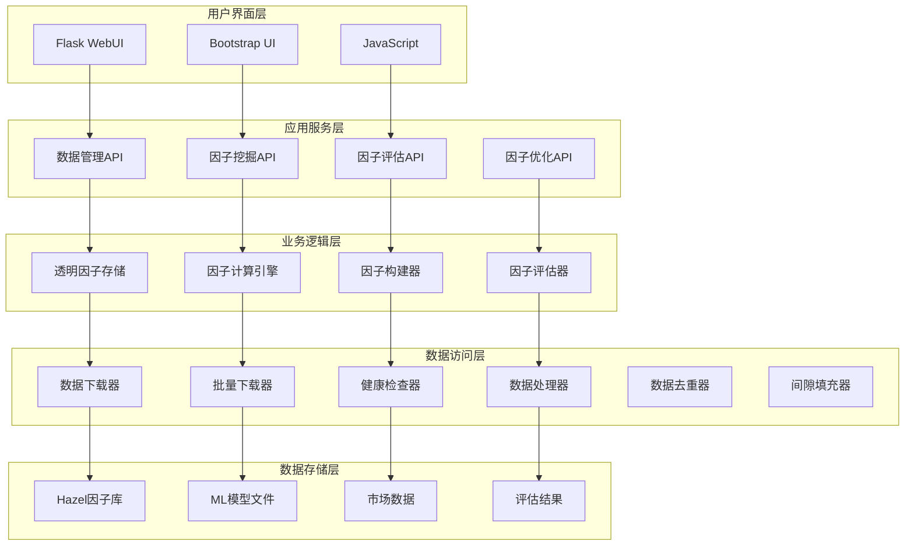

# FactorMiner - 量化因子挖掘平台

[](https://www.python.org/)
[](LICENSE)
[]()
[](https://github.com/CharlesJ-ABu/FactorMiner)
[](https://github.com/CharlesJ-ABu)

> 🚀 **项目状态**: 积极维护中，定期更新功能和修复问题  
> 👨‍💻 **维护者**: [@CharlesJ-ABu](https://github.com/CharlesJ-ABu)  
> 📅 **最后更新**: 2025年8月  
> 🎯 **目标**: 构建最先进的量化因子挖掘平台

专业的量化因子挖掘、评估和优化平台，基于V3架构设计，帮助量化交易者和研究人员构建高质量的量化因子。

## 📋 目录

- [🚀 快速开始](#-快速开始)
- [✨ 主要特性](#-主要特性)
- [🏗️ 项目架构](#️-项目架构)
- [📦 安装部署](#-安装部署)
- [📚 使用指南](#-使用指南)
- [🔧 配置说明](#-配置说明)
- [🛠️ 维护工具](#️-维护工具)
- [🤝 贡献指南](#-贡献指南)
- [🔮 未来规划](#-未来规划)

## 🚀 快速开始

### 1. 环境准备
```bash
# 克隆项目
git clone https://github.com/CharlesJ-ABu/FactorMiner.git
cd FactorMiner

# 创建虚拟环境
python -m venv venv
source venv/bin/activate  # Linux/Mac
# 或
venv\Scripts\activate     # Windows

# 安装依赖
pip install -r requirements.txt
```

### 2. 启动Web界面
```bash
# 启动Web服务
python run_webui.py

# 在浏览器中访问
# http://localhost:8080
```

### 3. 运行示例代码
```bash
# 进入examples目录
cd examples

# 运行因子挖掘工作流示例
python factor_mining_workflow.py

# 运行透明因子存储演示
python transparent_factor_demo.py

# 运行交易因子使用示例
python trading_factor_usage.py
```

### 4. 使用预构建因子
```python
from factor_miner.core.factor_engine import get_global_engine
from factor_miner.core.factor_storage import get_global_storage

# 初始化核心组件
storage = get_global_storage()
engine = get_global_engine()

# 计算Hazel技术因子
factor_series = engine.compute_single_factor('Hazel-price_momentum_5', data)
```

### 5. 5分钟快速体验
```bash
# 1. 启动Web界面
python run_webui.py

# 2. 访问 http://localhost:8080

# 3. 在"数据下载"页面下载BTC_USDT的1小时数据

# 4. 在"因子挖掘"页面选择"技术因子"开始挖掘

# 5. 查看挖掘结果和评估报告
```

## ✨ 主要特性

### 🎯 核心功能
- **V3架构设计**: 全新的透明因子存储系统，支持多种计算类型
- **稳定数据系统**: 修复核心下载问题，支持现货/期货数据完整获取和智能合并
- **数据质量管理**: 新增健康度检查、自动修复和断层填充功能，确保数据完整性
- **智能去重系统**: 统一按时间点去重逻辑，避免数据重复和间隙问题
- **动态下载优化**: 智能计算请求大小，提升数据下载效率和稳定性
- **丰富的因子库**: 包含27个Hazel技术因子，覆盖价格、动量、趋势、波动率、成交量等维度
- **多种因子类型**: 技术因子、统计因子、机器学习因子、高级因子
- **全面评估体系**: IC、IR、胜率、有效性得分等多种评估指标

### 🚀 高级功能
- **智能优化算法**: 贪婪算法、遗传算法、Lasso回归等多种优化方法
- **因子组合集成**: 等权重、IC加权、ML加权等多种组合方式
- **ML模型管理**: 自动保存和加载.pkl模型文件，支持模型推理
- **批量下载优化**: 智能分批下载，支持多时间框架和交易对

### 💻 用户体验
- **Web用户界面**: 直观的Web界面，支持实时进度显示和批量下载
- **完整API接口**: 提供完整的API接口，支持程序化调用
- **数据管理功能**: 支持多交易所数据下载、智能合并、数据质量检查
- **因子对比系统**: 新挖掘因子与现有因子库的智能对比

## 🏗️ 项目架构

### V3架构核心组件




### 支持的计算类型
- **`formula`**: 数学公式计算
- **`function`**: Python函数计算
- **`pipeline`**: ML流水线计算
- **`ml_model`**: 预训练模型推理

### 模块化设计
- **`@factor_miner/`**: 核心算法和因子构建逻辑
- **`@factorlib/`**: 因子存储和管理
- **`@webui/`**: Web用户界面，作为核心算法的客户端
- **`@data/`**: 数据管理和存储
- **`@config/`**: 配置管理

## 📦 安装部署

### 环境要求
- **Python**: 3.8+
- **内存**: 建议8GB+
- **存储**: 建议50GB+ (用于存储市场数据)
- **网络**: 稳定的网络连接 (用于数据下载)

### 详细安装步骤

#### 1. 系统依赖
```bash
# Ubuntu/Debian
sudo apt-get update
sudo apt-get install python3-dev python3-pip python3-venv

# macOS
brew install python3

# Windows
# 下载并安装Python 3.8+
```

#### 2. 项目安装
```bash
# 克隆项目
git clone https://github.com/CharlesJ-ABu/FactorMiner.git
cd FactorMiner

# 创建虚拟环境
python3 -m venv venv

# 激活虚拟环境
source venv/bin/activate  # Linux/macOS
# 或
venv\Scripts\activate     # Windows

# 升级pip
pip install --upgrade pip

# 安装依赖
pip install -r requirements.txt
```

#### 3. 配置设置
```bash
# 复制配置文件模板
cp config/user_config_template.py config/user_config.py

# 编辑配置文件，添加API密钥
nano config/user_config.py
```

## 📚 使用指南

### 🎯 因子库概览

#### Hazel技术因子库 (27个因子)
FactorMiner现在包含27个预构建的Hazel技术因子，覆盖多个维度：

**价格因子 (5个)**
- `Hazel-raw_close`, `Hazel-raw_high`, `Hazel-raw_low`, `Hazel-raw_open`, `Hazel-raw_volume`

**动量因子 (3个)**
- `Hazel-price_momentum_5`: 5期价格动量
- `Hazel-volume_momentum_5`: 5期成交量动量
- `Hazel-momentum_strength`: 动量强度指标

**趋势因子 (2个)**
- `Hazel-trend_strength_10`: 10期趋势强度
- `Hazel-trend_consistency_3`: 3期趋势一致性

**波动率因子 (2个)**
- `Hazel-volatility_10`: 10期波动率
- `Hazel-volatility_change`: 波动率变化

**价格位置因子 (2个)**
- `Hazel-price_position_20`: 20期价格位置
- `Hazel-support_resistance_20`: 20期支撑阻力

**成交量因子 (4个)**
- `Hazel-volume_acceleration`: 成交量加速度
- `Hazel-volume_breakout_20`: 20期成交量突破
- `Hazel-volume_price_ratio`: 成交量价格比率
- `Hazel-volume_price_divergence`: 成交量价格背离

**技术评分 (2个)**
- `Hazel-technical_score`: 综合技术评分
- `Hazel-market_sentiment_10`: 10期市场情绪

**其他技术因子 (7个)**
- `Hazel-price_acceleration`: 价格加速度
- `Hazel-price_breakout_20`: 20期价格突破
- `Hazel-price_breakdown_20`: 20期价格崩溃
- `Hazel-price_reversal`: 价格反转
- `Hazel-long_price_change_20`: 20期长期价格变化
- `Hazel-medium_price_change_10`: 10期中期价格变化
- `Hazel-short_price_change_1`: 1期短期价格变化

### 🔧 因子构建

#### 技术因子 (`factor_miner/factors/technical.py`)
- **趋势指标**: 移动平均线、趋势强度、价格位置
- **动量指标**: RSI、MACD、随机指标
- **波动率指标**: ATR、布林带、肯特纳通道
- **成交量指标**: OBV、VWAP、资金流量指标
- **价格模式**: 支撑阻力、缺口、形态识别

#### 统计因子 (`factor_miner/factors/statistical.py`)
- **滚动统计**: 均值、标准差、偏度、峰度
- **分布特征**: 分位数、Z-score、百分位排名
- **相关性因子**: 自相关、交叉相关、线性回归

#### 高级因子 (`factor_miner/factors/advanced.py`)
- **交互因子**: 多因子组合、比率因子
- **滞后因子**: 不同时间窗口的滞后特征
- **自定义因子**: 用户定义的复杂因子

#### 机器学习因子 (`factor_miner/factors/ml_factors.py`)
- **集成学习**: 随机森林、梯度提升、Lasso、Ridge回归
- **降维技术**: PCA主成分分析、特征选择（F检验、互信息）
- **自适应模型**: 滚动窗口训练、动态特征选择
- **模型存储**: 自动保存`.pkl`模型文件，支持模型版本管理
- **推理接口**: 通过`ml_model`计算类型加载模型，支持实时预测

### 📊 因子评估

#### 评估指标
- **IC (信息系数)**: 因子与未来收益的相关性
- **IR (信息比率)**: IC的稳定性指标
- **胜率**: 因子预测正确的比例
- **有效性得分**: 综合评估指标

#### 评估流程
1. 自动计算多个时间窗口的IC值
2. 生成详细的评估报告
3. 支持样本内外测试

### 🎯 因子优化

#### 优化方法
- **贪婪算法**: 逐步选择最优因子
- **遗传算法**: 模拟自然选择过程
- **Lasso回归**: 基于L1正则化的特征选择

#### 优化目标
- 最大化IC值
- 最小化因子间相关性
- 控制因子数量

### 🔗 因子组合

#### 组合方法
- **等权重组合**: 所有因子权重相等
- **IC加权组合**: 根据IC值确定权重
- **ML加权组合**: 使用机器学习方法确定权重

### 📈 数据管理

#### 数据下载
1. 访问WebUI的"数据下载"页面
2. 选择交易类型（现货/期货）
3. 选择交易对和时间框架
4. 设置时间范围并开始下载
5. 支持智能合并，避免重复数据

#### 数据查看
1. 访问WebUI的"数据查看"页面
2. 查看现有数据覆盖情况
3. 检查数据质量和完整性
4. 支持多时间框架查询

### 🔍 因子挖掘

#### 基本流程
1. 选择数据源和交易对
2. 选择因子类型（技术、统计、ML、高级）
3. 设置评估参数（最小IC、最小IR）
4. 开始挖掘并监控进度
5. 查看因子对比报告
6. 选择要保存的因子

#### 因子对比
- 自动对比新因子与现有因子库
- 比较因子定义、函数代码、模型文件
- 识别重复、相似或全新的因子
- 支持选择性保存

### 📊 因子评估

#### 评估指标
- **IC值**: 衡量因子预测能力
- **IR值**: 衡量因子稳定性
- **胜率**: 衡量因子准确性
- **有效性得分**: 综合评估指标

#### 评估流程
1. 自动计算多个时间窗口的IC值
2. 生成详细的评估报告
3. 保存评估结果到因子库

## 🔧 配置说明

### 主要配置项

```python
# 数据源配置
DATA_SOURCES = {
    'binance': {
        'data_dir': 'data/binance',
        'supported_pairs': ['BTC_USDT', 'ETH_USDT', 'BNB_USDT', 'SOL_USDT'],
        'supported_timeframes': ['1m', '5m', '15m', '1h', '4h', '1d']
    }
}

# 因子配置
FACTOR_CONFIG = {
    'default_windows': [5, 10, 20, 50, 100, 200],
    'default_lags': [1, 2, 3, 5, 8, 13, 21],
    'ml_models': ['random_forest', 'gradient_boosting', 'ridge', 'lasso']
}

# 评估配置
EVALUATION_CONFIG = {
    'min_data_points': 100,
    'ic_window': 20,
    'rolling_window': 60,
    'significance_level': 0.05
}
```

### 用户配置

在 `config/user_config.py` 中配置交易所API密钥：

```python
EXCHANGE_CONFIGS = {
    1: {
        'exchange': 'binance',
        'api_key': 'your_api_key',
        'secret': 'your_secret_key',
        'proxy': 'http://127.0.0.1:7890'  # 可选
    }
}
```

## 🛠️ 维护工具

### 实用脚本

#### 健康检查
```bash
# 检查因子库健康状态
python scripts/factorlib_health_check.py

# 分析因子质量和性能
python scripts/factor_analysis_tool.py
```

#### 修复工具
```bash
# 修复空的评估结果
python scripts/repair_empty_evaluations.py

# 清理因子名称
python scripts/clean_factor_names.py
```

#### 数据管理工具 (NEW)
```bash
# 数据健康度检查 (新增)
python -c "from factor_miner.core.data_health_checker import health_checker; print(health_checker)"

# 数据断层填充 (新增)
python -c "from factor_miner.core.data_gap_filler import gap_filler; print(gap_filler)"

# 数据处理工具 (新增)
python -c "from factor_miner.core.data_processor import data_processor; print(data_processor)"
```

#### 因子注册
```bash
# 注册Hazel技术因子
python scripts/register_hazel_factors.py
```

### 定期维护

1. **每周**: 运行健康检查脚本
2. **每月**: 分析因子性能，清理无效因子
3. **每季度**: 更新因子库，优化因子组合

## 🏗️ 项目结构

```
FactorMiner/
├── README.md                    # 项目主文档
├── requirements.txt             # 依赖包
├── run_webui.py                 # WebUI启动脚本
├── config/                      # 配置文件目录
│   ├── settings.py              # 主配置文件
│   ├── webui_config.py          # WebUI配置
│   └── user_config.py           # 用户配置（API密钥等）
├── factor_miner/                # 核心因子挖掘模块
│   ├── core/                    # 核心功能
│   │   ├── factor_engine.py     # 因子计算引擎
│   │   ├── factor_storage.py    # 透明因子存储
│   │   ├── factor_builder.py    # 因子构建器
│   │   ├── factor_evaluator.py  # 因子评估器
│   │   ├── factor_optimizer.py  # 因子优化器
│   │   ├── data_loader.py       # 数据加载器
│   │   ├── data_downloader.py   # 数据下载器
│   │   └── feature_pipeline.py  # 特征工程管道
│   ├── factors/                 # 因子类型
│   │   ├── technical.py         # 技术因子
│   │   ├── statistical.py       # 统计因子
│   │   ├── ml_factors.py        # 机器学习因子
│   │   └── advanced.py          # 高级因子
│   └── api/                     # API接口
│       └── factor_api.py        # 因子API
├── factorlib/                   # 因子库
│   ├── definitions/             # 因子定义文件 (包含27个Hazel因子)
│   ├── functions/               # 因子函数代码 (包含27个Hazel因子实现)
│   ├── models/                  # ML模型文件 (.pkl格式)
│   ├── evaluations/             # 评估结果
│   ├── exports/                 # 导出文件
│   └── temp/                    # 临时文件
├── webui/                       # WebUI模块
│   ├── app.py                   # Flask应用
│   ├── static/                  # 静态文件
│   ├── templates/               # HTML模板
│   └── routes/                  # 路由
├── data/                        # 数据目录
│   └── binance/                 # Binance数据
│       ├── spot/                # 现货数据
│       └── futures/             # 期货数据（永续合约）
├── scripts/                     # 实用脚本
│   ├── register_hazel_factors.py # Hazel因子注册脚本
│   ├── factorlib_health_check.py # 因子库健康检查
│   ├── factor_analysis_tool.py  # 因子分析工具
│   ├── repair_empty_evaluations.py # 修复空评估结果
│   └── clean_factor_names.py    # 清理因子名称
├── examples/                    # 示例代码
│   ├── factor_mining_workflow.py # 因子挖掘工作流
│   ├── transparent_factor_demo.py # 透明因子存储演示
│   ├── factor_storage_demo.py   # 因子存储演示
│   ├── trading_factor_usage.py  # 交易因子使用示例
│   ├── data_management_demo.py  # 数据管理演示
│   └── batch_download_demo.py   # 批量下载演示
├── docs/                        # 文档目录
│   ├── README.md                # 文档总览
│   ├── api.md                   # API文档
│   ├── factor_storage_guide.md  # 因子存储架构指南
│   └── vpn_setup.md            # VPN设置指南
└── logs/                        # 日志目录
```

## 🧪 测试

运行测试套件：

```bash
python -m pytest tests/
```

或运行特定测试：

```bash
python tests/test_basic.py
```

## 📄 文档

- [文档总览](docs/README.md) - 项目文档索引
- [API文档](docs/api.md) - 完整的API接口文档
- [因子存储架构指南](docs/factor_storage_guide.md) - V3架构详解
- [VPN设置指南](docs/vpn_setup.md) - 网络配置说明

## 🤝 贡献指南

欢迎贡献代码！FactorMiner是一个开源项目，我们欢迎所有形式的贡献。

### 如何贡献

1. **Fork 项目**
2. **创建功能分支** (`git checkout -b feature/AmazingFeature`)
3. **提交更改** (`git commit -m 'Add some AmazingFeature'`)
4. **推送到分支** (`git push origin feature/AmazingFeature`)
5. **打开 Pull Request**

### 开发原则

- **核心逻辑**: 所有核心算法都在 `@factor_miner/` 模块中
- **WebUI**: 作为核心算法的客户端，不包含核心逻辑
- **代码质量**: 遵循PEP 8规范，添加适当的注释
- **测试覆盖**: 新功能需要包含相应的测试用例

### 问题反馈

- 使用 [GitHub Issues](https://github.com/CharlesJ-ABu/FactorMiner/issues) 报告问题
- 提供详细的错误信息和复现步骤
- 包含系统环境和使用场景信息

### 功能建议

- 使用 [GitHub Discussions](https://github.com/CharlesJ-ABu/FactorMiner/discussions) 讨论新功能
- 分享使用经验和最佳实践
- 提出改进建议和优化方案

### 代码贡献

- 提交高质量的代码，遵循项目编码规范
- 为新功能添加相应的测试用例
- 更新相关文档和示例代码

### 联系维护者

如果您有任何问题或建议，欢迎直接联系项目维护者 [@CharlesJ-ABu](https://github.com/CharlesJ-ABu)：
- 通过 GitHub Issues 或 Discussions
- 参与项目讨论和开发
- 分享您的使用经验和反馈

## 📄 许可证

本项目采用 MIT 许可证 - 查看 [LICENSE](LICENSE) 文件了解详情。

## 🙏 致谢

感谢所有为这个项目做出贡献的开发者和研究人员。

## 📞 联系方式

- **项目主页**: [GitHub](https://github.com/CharlesJ-ABu/FactorMiner)
- **项目维护者**: [@CharlesJ-ABu](https://github.com/CharlesJ-ABu)
- **问题反馈**: [Issues](https://github.com/CharlesJ-ABu/FactorMiner/issues)
- **讨论交流**: [Discussions](https://github.com/CharlesJ-ABu/FactorMiner/discussions)

## 📝 更新日志

### V3.1.1 (2025年8月) - 数据质量管理优化
- ✅ **修复数据去重逻辑错误**：统一按时间点去重，确保数据一致性
- ✅ **优化数据下载系统**：实现动态limit计算，智能设置请求大小
- ✅ **增强数据健康检查**：严格要求100分才能保存，提升数据质量
- ✅ **修复时区处理问题**：确保时间戳比较的一致性
- ✅ **优化前端界面**：改进K线图显示和模态框尺寸
- 🔄 **机器学习训练优化**：分批训练和超时保护（进行中）

### V3.1.0 (2025年8月) - 核心功能完善
- ✅ 扩展Hazel技术因子库
- ✅ 修复ML因子挖掘和存储问题
- ✅ 优化批量数据下载功能
- ✅ 新增数据质量管理系统

## 🔮 未来规划

> 📋 **详细规划请查看**: [TODO.md](./TODO.md) - 包含完整的任务列表和进度跟踪

FactorMiner 将继续在以下方向发展：

### 🚀 **近期重点**
- 完善机器学习训练稳定性
- 增强数据质量管理系统
- 优化因子挖掘和评估流程

### 🔮 **长期愿景**
- 构建完整的量化因子生态
- 支持多交易所和多资产类别
- 实现智能化的因子发现和优化
- 提供企业级的量化研究平台

> 💡 **贡献建议**: 欢迎通过 [Issues](https://github.com/CharlesJ-ABu/FactorMiner/issues) 和 [Discussions](https://github.com/CharlesJ-ABu/FactorMiner/discussions) 提出功能建议和改进意见。

## 💡 最佳实践

### 🚀 快速上手流程
1. **环境准备** → 安装Python 3.8+和依赖包
2. **数据获取** → 下载BTC_USDT等主流交易对数据
3. **因子使用** → 直接使用27个预构建的Hazel因子
4. **因子挖掘** → 基于现有数据挖掘新的技术因子
5. **因子评估** → 使用IC、IR等指标评估因子质量
6. **因子组合** → 构建多因子组合策略

### 📊 数据预处理
- 确保数据质量，处理缺失值
- 统一数据格式和时间戳
- 进行数据标准化
- 使用健康度检查确保数据完整性
- 避免重复时间点，确保数据连续性
- 处理时区问题，统一使用UTC时间

### 🔧 因子构建
- 从简单因子开始，逐步增加复杂度
- 注意因子的经济含义
- 避免过度拟合

### 📈 因子评估
- 使用多个评估指标
- 进行样本内外测试
- 考虑交易成本和滑点

### ⚡ 因子优化
- 根据实际需求选择优化方法
- 控制因子数量，避免过拟合
- 定期重新评估和更新

### 🛡️ 风险管理
- 设置止损和止盈
- 控制仓位大小
- 监控因子表现

### 🎯 常见使用场景
- **量化研究**: 使用Hazel因子库进行因子研究
- **策略开发**: 基于因子挖掘结果开发交易策略
- **风险管理**: 使用因子评估结果进行风险控制
- **学术研究**: 因子挖掘算法的研究和改进

---

**注意**：本项目仅供学习和研究使用，不构成投资建议。使用本软件进行实际交易的风险由用户自行承担。

*最后更新: 2025年8月*
